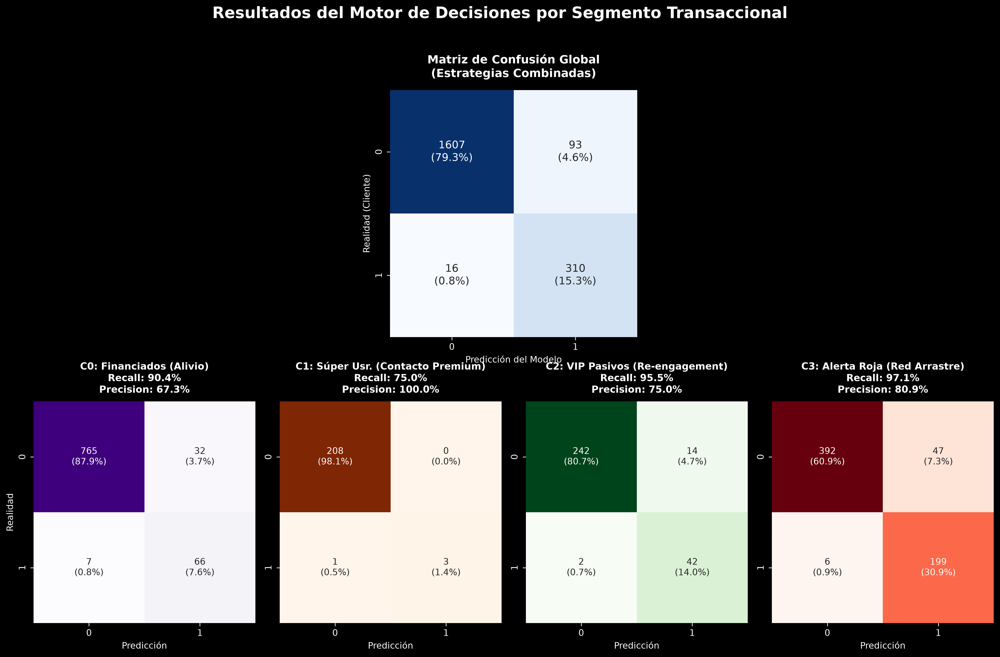
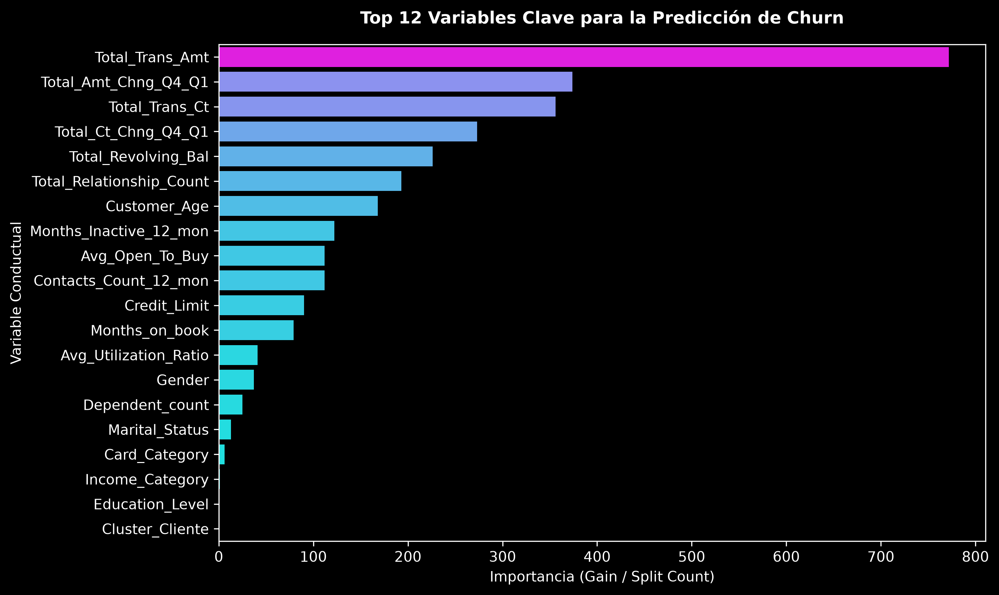
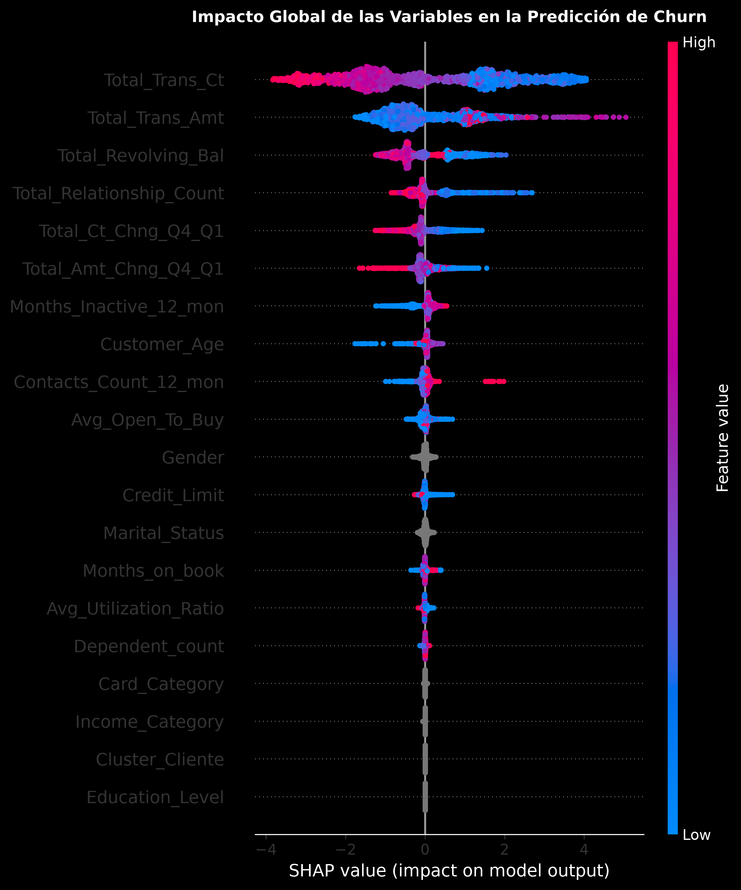
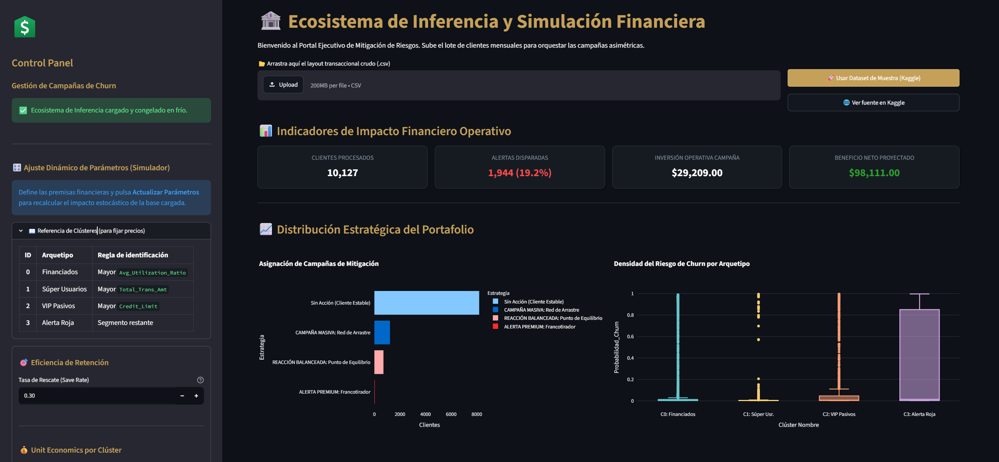
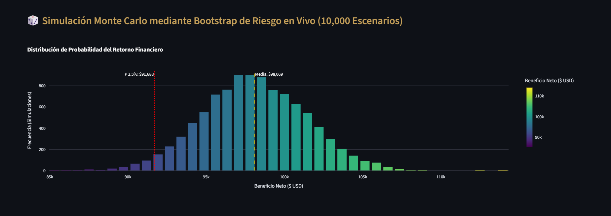

# 🏦 Framework de Retención Bancaria: Optimización Cost-Sensitive, Gestión Estocástica de Riesgos e Inferencia MLOps

Este repositorio contiene un ecosistema de producción automatizado y modular para la identificación, segmentación transaccional y contención proactiva de la fuga de clientes (*churn*) en una cartera de tarjetas de crédito. 

A diferencia de los enfoques tradicionales que optimizan métricas puramente estadísticas (como F1-Score o Accuracy), este sistema implementa un **Motor de Decisiones Sensible al Costo (Cost-Sensitive Learning)** calibrado mediante optimización empírica en un conjunto de validación aislado, respaldado por un **Mapeo Canónico de Centroides** y validado financieramente a través de simulaciones estocásticas de **Monte Carlo (Bootstrap Dual)**.

> **[📊 Simulación Estratégica Interactiva (Streamlit App)](https://bank-churn-mlops-framework.streamlit.app/)**

## 🏗️ La Arquitectura de los 3 Pilares (Separación de Responsabilidades)

El framework está diseñado siguiendo las mejores prácticas de **MLOps**, dividiendo el ciclo de vida del modelo en tres scripts independientes y especializados que eliminan el riesgo de *Data Leakage* y facilitan la automatización:

1. **`main.py` (Pipeline de Entrenamiento y Calibración):** Se ejecuta de forma asíncrona o estacional. Ingiere datos históricos, entrena el clasificador, ajusta los centroides de clustering, optimiza los umbrales financieros en validación y exporta el artefacto unificado en frío.
2. **`predict.py` (Pipeline de Operación en Lote / Batch Inference):** Script puramente operativo diseñado para Cron Jobs o tareas programadas mensuales. Carga el artefacto serializado, valida el contrato de datos entrante y procesa lotes masivos de nuevos clientes desde la terminal.
3. **`app.py` (El Simulador Estratégico Interactiva):** Interfaz web ejecutiva que permite a la dirección financiera estresar el portafolio en vivo frente a la volatilidad de los costos de mercado.

## 🛡️ 1. Blindaje de Datos y Metodología Antifraude (3-Way Split)

Para erradicar cualquier posibilidad de sobreajuste o fuga de información (*Data Leakage*), el framework opera bajo dos principios defensivos estrictos:

1. **Split en Tres Vías (60/20/20):**
* **Entrenamiento (60%):** Se utiliza exclusivamente para ajustar el escalador estático (`StandardScaler`), encontrar los centroides geométricos del clustering y entrenar los árboles de decisión del clasificador.
* **Validación (20%):** Se reserva de forma aislada para que el Motor de Decisiones barre la cuadrícula de umbrales probabilísticos y seleccione el punto óptimo de rentabilidad económica.
* **Prueba (20%):** Un universo completamente virgen que jamás fue visto por el clasificador ni por el optimizador de umbrales. Se utiliza estrictamente para simular el despliegue real en producción y auditar el riesgo estocástico.


2. **Validación de Contrato de Datos (Input Schema):** - Al ingresar datos nuevos al sistema de producción (ya sea vía `predict.py` o `app.py`), la clase `SistemaRetencionBancaria` ejecuta un filtrado defensivo. Si el archivo carece de alguna de las 21 columnas transaccionales requeridas o del identificador de negocio `CLIENTNUM`, el sistema detiene la ejecución de forma segura mediante un error controlado (`ValueError`), listando explícitamente las columnas faltantes antes de contaminar la memoria del modelo.

## 🦾 2. Robustez en Producción: Mapeo Canónico de Clústeres

El algoritmo K-Means adolece del problema de **permutación arbitraria de etiquetas**: cada vez que el modelo es reentrenado o los datos cambian de orden, los IDs de los clústeres cambian aleatoriamente (el clúster VIP puede pasar de ser el `0` al `3`), lo que rompería las reglas del negocio en producción.

Para solucionar esto, el módulo `clustering_models.py` incorpora una función de **Relabeling Canónico** (`_mapa_canonico_clusters`) que calcula los vectores promedio de los centroides en el Train Set y fuerza un remapeo determinista basado en arquetipos conductuales estables:

* **Clúster 0 (Financiados Rentables):** Identificado automáticamente por la mayor tasa de utilización media de la línea (`Avg_Utilization_Ratio`).
* **Clúster 1 (Súper Usuarios / Alto Valor):** Anclado por el mayor volumen de facturación monetaria (`Total_Trans_Amt`).
* **Clúster 2 (VIP Pasivos):** Determinado por poseer los límites de crédito más altos (`Credit_Limit`) combinados con baja actividad.
* **Clúster 3 (Alerta Roja):** Clientes con un severo deterioro transaccional y caída de actividad trimestral ($Q4/Q1$).

## 📐 3. Motor de Decisiones Asimétrico (Cost-Sensitive Learning)

En el negocio bancario, los errores tienen costos asimétricos. Ignorar a un desertor real (Falso Negativo) cuesta el valor completo de su LTV (Lifetime Value), mientras que molestar a un cliente estable por error (Falso Positivo) solo cuesta el valor marginal de una alerta digital.

El Motor de Decisiones incorpora una **Tasa de Rescate Realista (`save_rate = 30%`)**, asumiendo que solo 3 de cada 10 clientes interceptados aceptarán la campaña de retención. Los parámetros económicos inyectados por segmento son:

| Clúster Conductual | Acción Comercial (Estrategia) | Costo Operativo Alerta | LTV de Rescate (Valor Cliente) |
| --- | --- | --- | --- |
| **C1: Súper Usuarios** | **Francotirador** (Ejecutivo + Condonación) | $250 USD | $2,000 USD |
| **C0: Financiados** | **Punto de Equilibrio** (Promoción de Tasa) | $35 USD | $450 USD |
| **C2: VIP Pasivos** | **Punto de Equilibrio** (Regalo condicionado) | $25 USD | $600 USD |
| **C3: Alerta Roja** | **Red de Arrastre** (Email / MSI Automático) | $2 USD | $100 USD |

### Calibración de Umbrales sobre Validación

El script ejecuta un barrido empírico de alta densidad (`np.linspace`) en el set de Validación para encontrar el umbral exacto que maximiza el beneficio neto por clúster, utilizando un anclaje analítico de *break-even* ($p^* = \frac{\text{Costo}}{\text{save\_rate} \times \text{LTV}}$) cuando el volumen de fuga en el segmento es muy pequeño para aportar evidencia estadística:

* **Umbrales Óptimos Calibrados:**
    - C0: `0.1250`
    - C1: `0.4167`
    - C2: `0.1400`
    - C3: `0.1050`

> Los Umbrales son calibrados de forma automática por el script `main.py` y se inyectan de forma dinámica en el artefacto final `.joblib`, lo que permite que el pipeline de inferencia (`predict.py`) ejecute la segmentación y contención sin necesidad de hardcodear valores o realizar ajustes manuales posteriores.

## 📈 4. Evaluación Global e Interpretabilidad

El clasificador **LightGBM** alcanzó un rendimiento de **ROC-AUC de 0.9913** en el conjunto de pruebas intacto. Los análisis de diagnóstico y interpretabilidad automatizados revelan lo siguiente:

### Matrices de Confusión por Arquetipo Operativo
A continuación, se detalla el rendimiento del clasificador sobre cada segmento conductual canónico antes de la aplicación del motor cost-sensitive:

<p align="center">
  
</p>

### Importancia de Variables y Suministro de SHAP
* **Feature Importance:** El modelo se apoya masivamente en variables puramente dinámicas: el monto total de transacciones (`Total_Trans_Amt`) y la desaceleración del conteo de transacciones entre trimestres (`Total_Ct_Chng_Q4_Q1`) dominan las decisiones de corte.

<p align="center">
  
</p>

* **Interpretabilidad SHAP:** Valida la dirección del riesgo, demostrando de forma no lineal cómo una caída drástica en la cantidad de transacciones empuja exponencialmente la probabilidad del cliente hacia la zona de fuga.

<p align="center">
  
</p>

---

#### 🔗 Reportes de Diagnóstico Interactivos (Plotly)
Para explorar las métricas estadísticas estándar, puede visualizar los siguientes reportes HTML dinámicos:
* [🔍 Curva ROC con mapeo de F1-Score](outputs/interactive_roc_curve.html)
* [🔍 Curva Precision-Recall con mapeo de F1-Score](outputs/interactive_precision_recall.html)
* [🔍 Comportamiento de Métricas ML (Precision, Recall, F1) vs. Umbral de Probabilidad](outputs/interactive_tuning_umbrales.html)

## 🎲 5. Gestión del Riesgo Estocástico: Bootstrap Monte Carlo

Para validar la solidez del Motor Cost-Sensitive ante la volatilidad del mercado, el pipeline ejecuta un **Bootstrap Dual Competitivo con 10,000 simulaciones con reemplazo** sobre el conjunto de pruebas intacto, enfrentando a nuestra **Estrategia A (Segmentada por Clústeres)** contra una **Estrategia B (Campaña Agresiva Global)** que aplica el umbral más bajo (`0.1100`) de forma masiva a todo el portafolio.

### Resultados de la Simulación Estocástica:

* **Estrategia A (Segmentada):** Promedio Esperado: **$18,173 USD** | Peor Escenario (2.5%): $15,408 USD | Mejor Escenario (97.5%): $21,122 USD.
* **Estrategia B (Agresiva Global):** Promedio Esperado: **$18,069 USD** | Peor Escenario (2.5%): $15,137 USD | Mejor Escenario (97.5%): $21,174 USD.
* **Riesgo de Pérdida Financiera:** **0.0000%** en ambas estrategias.
* **Veredicto de Riesgo:** **$P(\text{Segmentada supera a Global}) = 59.0\%$**

### Conclusión Estratégica

Los números demuestran un **empate estadístico** en el retorno financiero bruto, con una ligera ventaja media de **$103 USD** a favor de nuestra segmentación. Sin embargo, **la calidad del riesgo favorece rotundamente a la Estrategia Segmentada**. La estrategia agresiva global logra rescatar un par de clientes adicionales, pero a cambio de disparar una cantidad masiva de falsas alarmas (Falsos Positivos) en los clústeres de alto valor, incrementando los costos operativos de forma innecesaria. La Estrategia Segmentada mantiene el mismo nivel de rentabilidad pero **protege los canales de atención humana, optimiza el presupuesto operativo y previene la fatiga de comunicación por spam** en los segmentos más valiosos del banco.

## 🖥️ 6. El Simulador Estratégico de Inferencia (Streamlit App)

Para acercar el backend de Machine Learning a los tomadores de decisiones del banco, el archivo `app.py` despliega una aplicación web interactiva que sirve como la interfaz de usuario del modelo en producción.

> **[📊 Simulación Estratégica Interactiva (Streamlit App)](https://bank-churn-mlops-framework.streamlit.app/)**

<p align="center">
  
</p>

### Características Clave del Simulador:

* **Inferencia en un Clic (Drag & Drop):** Permite arrastrar un lote de clientes mensuales crudos. El sistema los formatea, valida el contrato de datos, alinea las columnas al orden estricto del modelo e infiere las métricas en segundos.

* **Panel de Control Financiero Lateral:** Sliders para modificar interactivamente la tasa de retención (Save Rate), los costos de alerta y el LTV de rescate por clúster. La app recalcula en vivo los umbrales óptimos, las pérdidas y el beneficio neto proyectado de la base cargada.

* **Simulación Monte Carlo en Vivo (10,000 Escenarios):** Mediante operaciones vectorizadas con NumPy, la aplicación ejecuta al instante 10,000 remuestreos con reemplazo (Bootstrap) para estresar financieramente el portafolio ante los nuevos costos ingresados por el usuario. Si la columna `Churn_Real` está presente, se usará para calcular el beneficio neto real; de lo contrario, se simulará usando la probabilidad de fuga inferida por el modelo.

* **Narrativa Visual en Espectro *Viridis*:** El histograma de riesgo se renderiza dinámicamente mediante bins precalculados en el backend, pintando un gradiente horizontal con la paleta *Viridis* (tonos oscuros para zonas de volatilidad a la izquierda; amarillos brillantes conforme la distribución de dinero se desplaza con seguridad hacia la derecha de la media).

* **Botón de Prueba Rápida (UX Pro):** Integra un botón nativo (`st.button`) para precargar el dataset original de Kaggle alojado localmente en la infraestructura, junto a un botón de enlace simétrico (`st.link_button`) hacia la fuente oficial, permitiendo demostraciones instantáneas a usuarios externos sin requerir la preparación manual de archivos.

* **Descarga del Entregable Comercial:** Al finalizar la inferencia, habilita la descarga directa de un archivo CSV operativo que reinyecta deterministamente el identificador `CLIENTNUM` al inicio de la tabla, listo para ser consumido por las plataformas de CRM o los canales tradicionales de marketing.

<p align="center">
  
</p>

## 🚀 7. Guía de Ejecución en Producción

### 📋 Contrato de Datos de Entrada (Input Schema)

Para que cualquier flujo de inferencia opere, el archivo CSV provisto **debe contener obligatoriamente las siguientes 21 columnas** (el orden no importa, pero los nombres deben respetar las mayúsculas y guiones bajos exactos):

* **Identificadores:** `CLIENTNUM`

* **Demográficos:** `Customer_Age`, `Gender`, `Dependent_count`, `Education_Level`, `Marital_Status`, `Income_Category`, `Card_Category`

* **Relacionales:** `Months_on_book`, `Total_Relationship_Count`, `Months_Inactive_12_mon`, `Contacts_Count_12_mon`, `Credit_Limit`

* **Transaccionales:** `Total_Revolving_Bal`, `Avg_Open_To_Buy`, `Total_Amt_Chng_Q4_Q1`, `Total_Trans_Amt`, `Total_Trans_Ct`, `Total_Ct_Chng_Q4_Q1`, `Avg_Utilization_Ratio`

### Modo A: Reentrenamiento y Generación de Artefactos (Data Scientists)

Si se desea volver a entrenar los modelos con datos históricos nuevos y actualizar el archivo `.joblib` empaquetado reemplace el dataset original en `data/BankChurners.csv` por el nuevo archivo histórico (respetando el mismo formato) y ejecute:

```bash
python main.py
```

### Modo B: Inferencia Operativa en Lote (Ingeniería de Datos / Batch CLI)

Para procesar de forma automática y silenciosa la base de clientes activos del periodo utilizando el artefacto congelado en frío:

```bash
# Corrida estándar usando las rutas por defecto
python predict.py

# Corrida personalizada apuntando a un lote específico
python predict.py --input data/Clientes_Junio_2026.csv --output outputs/plan_operativo_retencion.csv
```

### Modo C: Portal de Simulación Estratégica (Usuarios de Negocio / Directivos)

Para levantar el simulador interactivo web local y estresar escenarios financieros:

```bash
streamlit run src/app.py
```
## 📁 Estructura del Repositorio Industrial

```text
├── data/
│   └── BankChurners.csv                 # Dataset original de Kaggle (Protegido en .gitignore)
├── notebooks/
│   └── sandbox_experimentacion.ipynb    # Bitácora de laboratorio e investigación descriptiva
├── outputs/                             # Centralización de Artefactos de Negocio y Reportes
│   ├── data_plan_accion_clientes.csv    # Entregable operativo de la corrida de entrenamiento
│   ├── data_resultados_financieros.csv  # Matriz maestra de métricas ML y Unit Economics
│   ├── data_perfil_segmentos_final.csv  # Mapeo estadístico de los arquetipos de cliente
│   ├── sistema_retencion_completo.joblib# Artefacto ÚNICO unificado de producción (Contenedor en frío)
│   ├── viz_resultados_estrategias.png   # Matrices de confusión maestra (Global vs Clústeres)
│   ├── viz_roi_financiero.png           # Reporte de Beneficio Neto Proyectado por segmento
│   ├── viz_feature_importance.png       # Importancia de variables nativa de LightGBM
│   ├── viz_shap_summary.png             # Interpretabilidad local y direccionalidad (SHAP)
│   ├── viz_riesgo_competitivo.png       # Campanas de Gauss solapadas del Bootstrap Monte Carlo
│   ├── interactive_precision_recall.html# Explorador dinámico de precisión/sensibilidad
│   ├── interactive_tuning_umbrales.html # Visor interactivo del comportamiento de métricas
│   └── interactive_roc_curve.html       # Curva ROC con mapeo interactivo de F1-Score
├── src/                                 # LA FÁBRICA (Módulos modulares de Python)
│   ├── __init__.py                      # Inicializador de paquete de software
│   ├── data_processing.py               # Ingesta, limpieza y split defensivo de 3 vías
│   ├── clustering_models.py             # Estandarización, K-Means y Mapeo Canónico
│   ├── classification_models.py         # Configuración nativa y entrenamiento de LightGBM
│   ├── decision_engine.py               # Optimización de umbrales, ROI y Bootstrap competitivo
│   └── inference.py                     # Clase del Contenedor de Inferencia y Validación de Contrato
├── .gitignore                           # Exclusión de entornos, cachés y datos pesados
├── app.py                               # El Simulador Estratégico Interactivo (Streamlit Web App)
├── main.py                              # Orquestador del Pipeline de Entrenamiento y Calibración
├── predict.py                           # Orquestador Operativo de Inferencia en Lote (Batch CLI)
└── requirements.txt                     # Dependencias e infraestructura de librerías

```